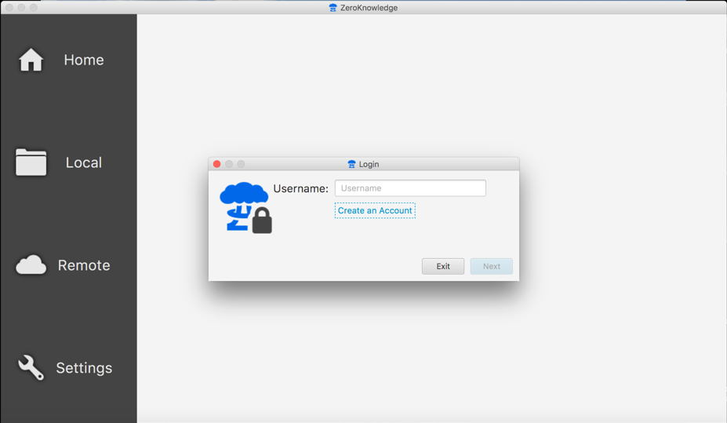
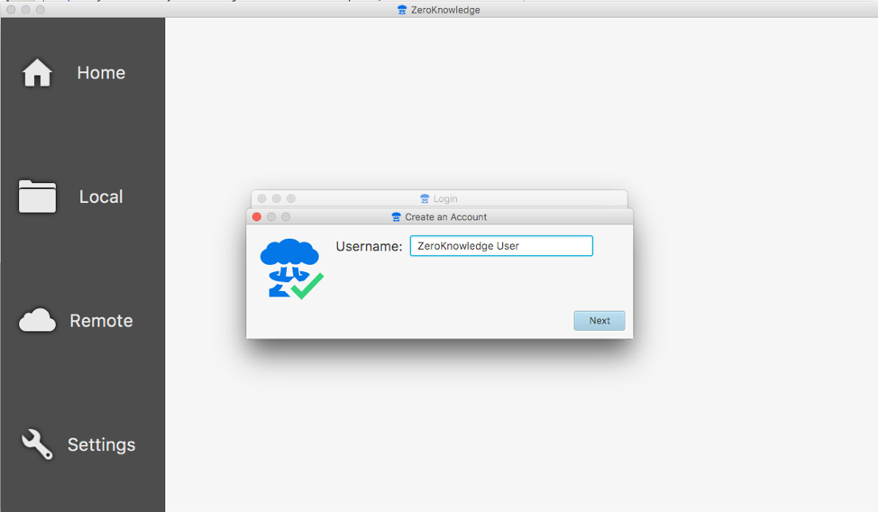
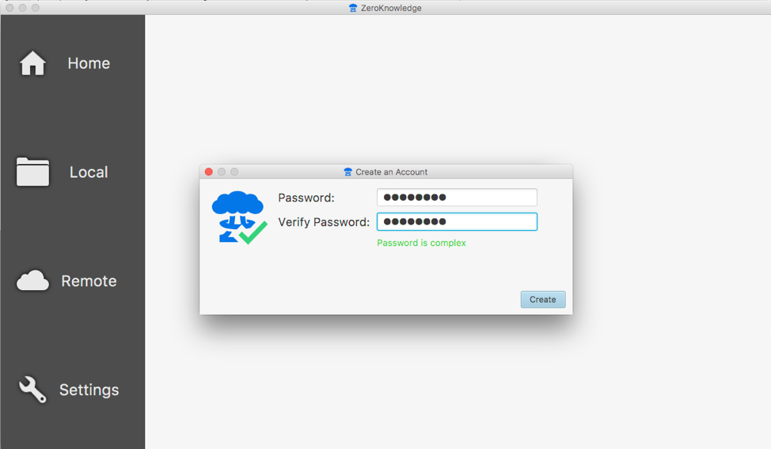
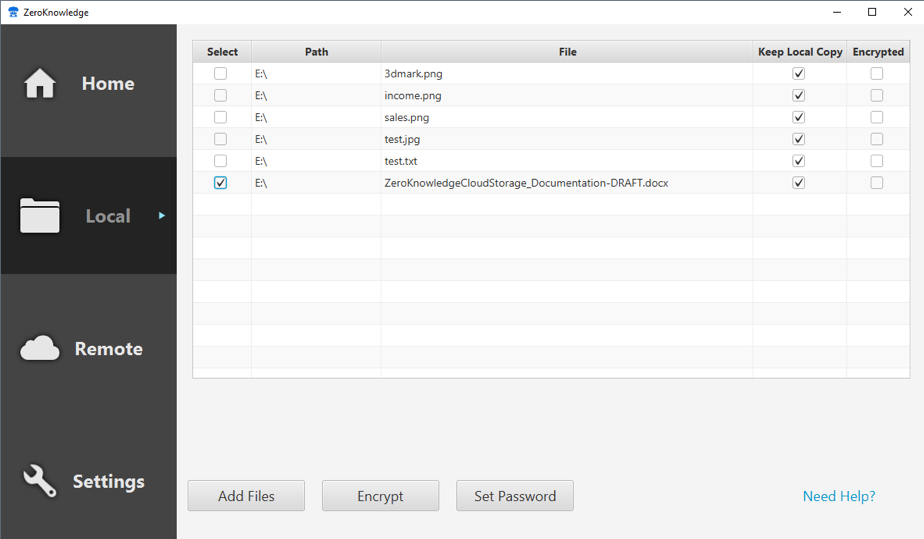
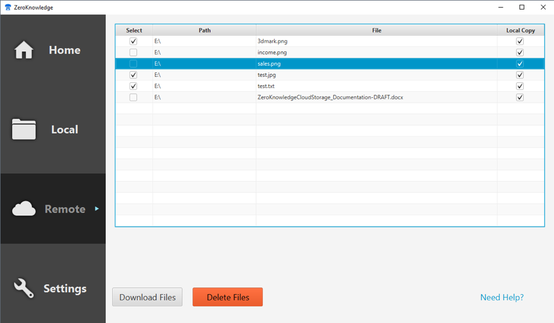
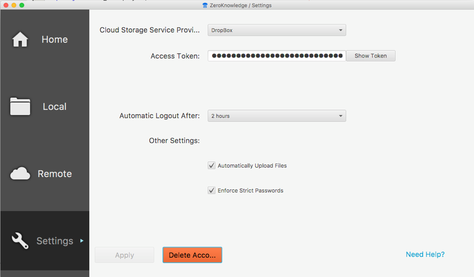
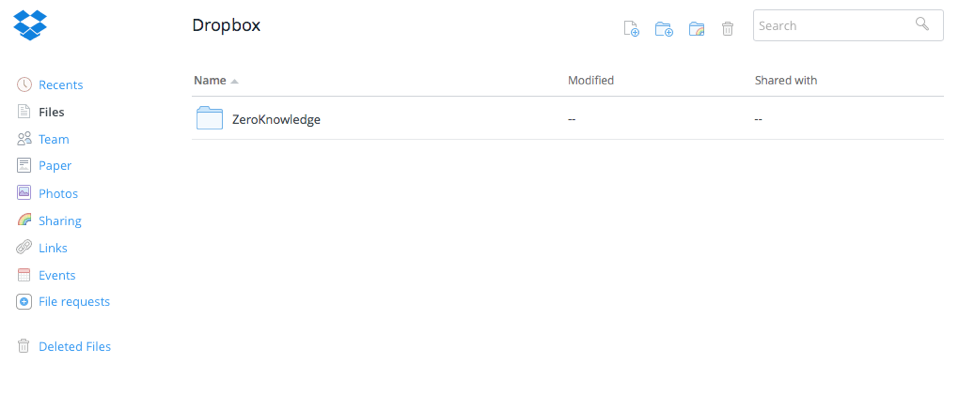

# Zero Knowledge Cloud Storage

### Team
* Josh Fox
* RaeMar Horne
* Kareem Nathan

## Overview

Many cloud storage providers have clauses built into their User Agreements that allow them, or third parties, to parse the data stored by users to gather data. This could pose a risk with sensitive items individuals store in their accounts.

The goal of this app is to allow users to upload a file locally to the app, encrypt the data, and upload the encrypted data to the cloud stoage provider DropBox so that no sensitive materials can be viewed. The username and password are stored locally using Secure Hash Algorithm 256 (SHA256). The private key to encrypt and decrypt the information is stored using Password-based Key Derivation Function 2 (PBKDF2). The documents are encrypted using Advanced Encryption Standard 256 (AES256). Only after the files are encrypted are they sent and stored in the cloud storage. To decrypt the encrypted file, the user downloads the file from the app and uses their password to decrypt it.

The app development is achieved by utilizing Java, DropBox API, and encryption standards SHA256, PBKDF2, AES256. JavaFX is utilized to supply the front-end User Interface (UI) to the user to view, upload, download, encrypt and decrypt files from the cloud storage account. Java is utilized to interface with the User Interface and DropBox API. DropBoxAPI is utilized to interface between the app and the user's cloud storage account.

### Dependencies
* Front-End = JavaFX
* Back-End = Java
* Cloud-Storage = DropBox API
* Encryption = SHA256, PBKDF2 and AES256

# Manual

## Start View

## Logging In/Registering a New User

**To log in to an already existing account:**

* Enter username
* Click the *next* button
* Enter password
* Click the *Login* button

**To register a new user:**

* Click the *Create An Account* button
* Enter desired username
* Click the *next* button
* Enter password
* Re-enter password for verification
* Click the *Login* button

**To Interface With DropBox**

* Click on the *Settings View*
* Click *Generate Access Token*
* Follow the instructions to allow the app access to the user's DropBox account
* Copy the DropBox Access Token
* Paste the Access Token into the *Access Token* field
* Click *Apply*

## Dashboard

Once a user has logged in, they will be taken to the application's dashboard. There are 4 tabs on the left side (Home, Local, Remote and Settings). 

## Home View

The Home view identifies the username that is currently logged in, the file index stating the encrypted folder name that is located on the user's home directory of their computer, and the cloud storage provider selected to store the encrypted files on.

## Local 

The Local view shows the files currently added to the application awaiting encryption. The user can *Add Files*, *Encrypt* files, and *Set Password* which can be set per file or to a single password for all files. Once the user presses *encrypt*, the files are automatically uploaded to DropBox.

## Remote View

The Remote view shows the files that are currently in the user's DropBox account (both encrypted and clear files). The user has the options to *Download Files* and decrypt encrypted files or *Delete Files* directly from the app.

## Settings View

The Settings view shows the user's selected cloud storage provider, Access Token to allow the app to interface with DropBox, automatic logout time, the ability to automatically upload files when encrypted and enforce passwords on encrypted files and the ability to *Delete Account*. 

 

## DropBox View

The view of the user's DropBox account shows a folder named ZeroKnowledge storing the encrypted files that have been uploaded from the app.

# Run

## Running the .jar file
- Double click the ZKCS.jar file to launch the app
